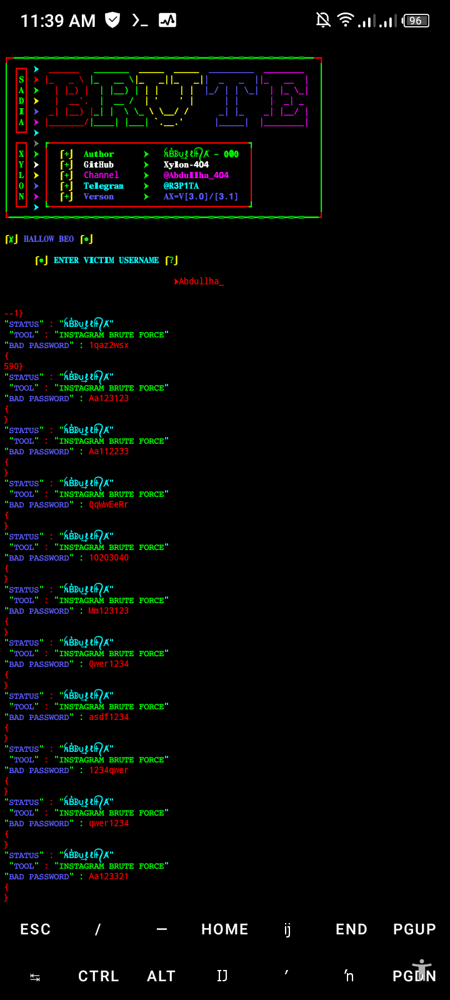

# BRUTE-FORCE🔥

<p align="center">

#### Language > </br>

 <p align="center">

## Requirements - 
- Stable Internet Connection
- 400+ MB Storage
- Termux Version Upto Date
- Android 7 or higher
- Required modules in requirements.txt
- No Root
- No Termux Knowlegde


 <p align="center">
</p>

#### INSTALL TOOL ON TERMUX

#### TOOL 1 STYLISH VERY DANGER
```python
rm -rf BRUTE-FORCE
git clone https://github.com/Xylon-404/BRUTE-FORCE.git
cd BRUTE-FORCE
python ᶦᶰ࿇ᴮᴿɄ₮𝙴.py
```

#### USERNAME 
```
xxx
```

#### Password 
```
xnxx
```
